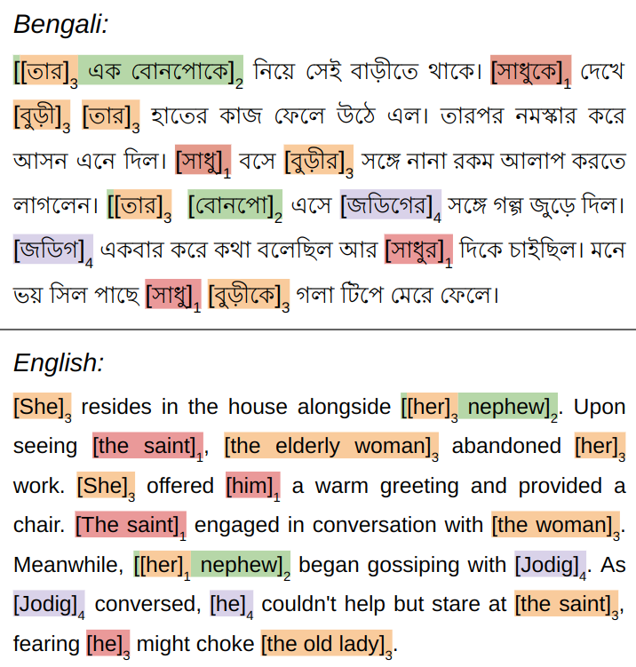

# BenCoref: A Multi-Domain Dataset of Nominal Phrases and Pronominal Reference Annotations

  

### Data Format

There are 4 .json files in the /data/train directory, for training and development sets. In the files, each line is a JSON string that encodes a document. The JSON object has the following fields:

"id": a string identifier of the document.
"sentences": the text. It is a list of sentences. Each sentence is a list of tokens. Each token is a string, which can be a word or a punctuation mark. A sentence that contains only one token of space is used to separate paragraphs in the text.
"mention_clusters": the mention clusters of the document. It is a list of mention clusters. Each mention cluster is a list of mentions. Each mention is a tuple of integers [sentence_idx, begin_idx, end_idx]. Sentence_idx is the index of the sentence of the mention. Begin_idx is the index of the first token of the mention in the sentence. End_index is the index of the last token of the mention in the sentence plus one. All indices are zero-based.

**Sample Datapoint**

sentence:

[['এক', 'বাড়ীতে', 'আগুন', 'লাগিয়াছিল', '।'],
 ['গৃহিণী',
  'বুদ্ধি',
  'করিয়া',
  'তাড়াতাড়ি',
  'সমস্ত',
  'অলঙ্কার',
  'একটা',
  'হাত',
  'বাক্সে',
  'পুরিয়া',
  'লইয়া',
  'ঘরের',
  'বাহির',
  'হইলেন',
  '।'],
 ['দ্বারে',
  'আসিয়া',
  'দেখিলেন',
  'সমাগত',
  'পুরুষেরা',
  'আগুন',
  'নিবাইতেছে',
  '।'],
 ['তিনি',
...
  'হইলেন',
  'না',
  '।'],
 ['ধন্য', '!'],
 ['কুল-কামিনীর', 'অবরোধ', '!']]
 
 mention_clusters:
 
 [[[1, 0, 0], [3, 0, 0], [6, 0, 0]], [[2, 3, 4], [3, 1, 1], [4, 5, 5]]]
